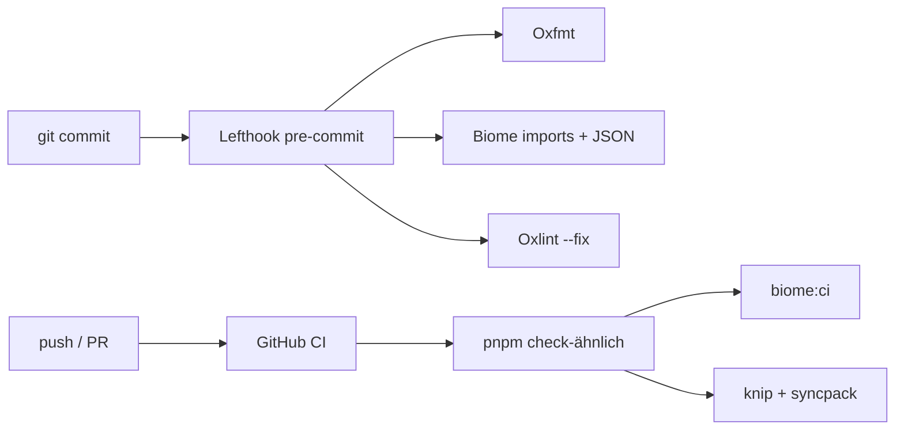

# Kamod UI — Interne Projekt-Dokumentation

Diese Datei fasst Entscheidungen und Hintergründe zusammen, die in der Entwicklung geklärt wurden: Ordnerstruktur (insbesondere „Docs“), README-Assets und das Entwickler-Tooling.

---

## Repo-Überblick

```
kamod-ui/
├── .github/
│   ├── assets/              # README-Bilder (Logos, Hero-Screenshot)
│   └── workflows/ci.yml     # CI-Pipeline
├── packages/docs/               # Live-Demo + interaktive Komponenten-Doku
│   └── src/docs/            # Quellcode der Doku-Seiten (/docs/button, …)
├── packages/core/           # @kamod-ch/ui — UI-Komponenten
├── biome.json               # Import-Sortierung, JSON-Format/Lint
├── knip.json                # Ungenutzte Dateien/Dependencies finden
├── lefthook.yml             # Git Pre-Commit-Hooks
└── README.md                # GitHub-Startseite (referenziert .github/assets/)
```

Das Projekt ist ein **pnpm-Workspace** mit zwei Haupt-Workspaces:

| Workspace      | Pfad             | Zweck                             |
| -------------- | ---------------- | --------------------------------- |
| `@kamod-ch/ui` | `packages/core/` | Veröffentlichbare UI-Komponenten  |
| `@kamod-ch/ui-docs` | `packages/docs/` | Docs-App, Kitchen Sink, Live-Doku |

---

## Zwei verschiedene „Docs“

Der Name `docs` war im Repo irreführend — es gibt **zwei getrennte Konzepte**, die nichts miteinander zu tun haben:

| Pfad                                       | Zweck                                                       | Konsument                                       |
| ------------------------------------------ | ----------------------------------------------------------- | ----------------------------------------------- |
| ~~`docs/images/`~~ → **`.github/assets/`** | Bilder für die **GitHub-README** (Logos, Kitchen-Sink-Hero) | GitHub rendert relative Pfade aus `README.md`   |
| `packages/docs/src/docs/`                      | **Interaktive Komponenten-Dokumentation** der Demo-App      | Browser unter `/docs/button`, `/docs/dialog`, … |

Die Demo-App liest **keine** Dateien aus `.github/assets/`. Die README nutzt **keine** Dateien aus `packages/docs/src/docs/`.

### Live-Doku (`packages/docs/src/docs/`)

Enthält u. a.:

- `registry.ts` — Register aller dokumentierten Komponenten
- `pages/*-doc.tsx` — Einzelseiten pro Komponente (Usage, API, Beispiele)
- `components/` — Shell, CodeBlock, ApiReference
- `DocsOverviewPage.tsx`, `DocsComponentPage.tsx` — Routing-Seiten

Erreichbar über die Demo unter [ui.kamod.ch](https://ui.kamod.ch/) bzw. lokal via `pnpm dev`.

---

## README-Assets: `.github/assets/`

### Hintergrund

Früher lagen README-Bilder unter `docs/images/`. Das wirkte wie Projekt-Dokumentation, war aber nur **Marketing/Branding für GitHub**:

- `logo-kamod-ui-dark.svg` / `logo-kamod-ui-light.svg` — Logo mit GitHub Light/Dark-Mode-Switch (`#gh-light-mode-only` / `#gh-dark-mode-only`)
- `kitchen-sink.png` — Hero-Screenshot im README

Der Pfad `docs/images/` war **Konvention**, kein technisches Muss. GitHub akzeptiert jeden relativen Pfad vom Repo-Root.

Zusätzlich stand `docs/` in `.gitignore` — neue Dateien dort wären ignoriert worden, während die drei Bilder historisch schon getrackt waren.

### Migration (Juni 2026)

Assets wurden nach `.github/assets/` verschoben:

| Alt                                   | Neu                                      |
| ------------------------------------- | ---------------------------------------- |
| `docs/images/logo-kamod-ui-dark.svg`  | `.github/assets/logo-kamod-ui-dark.svg`  |
| `docs/images/logo-kamod-ui-light.svg` | `.github/assets/logo-kamod-ui-light.svg` |
| `docs/images/kitchen-sink.png`        | `.github/assets/kitchen-sink.png`        |

**Angepasste Dateien:**

- `README.md` — alle drei Bildpfade
- `.gitignore` — Eintrag `docs/` entfernt (Ordner existiert nicht mehr)

**Referenzen in `README.md`:**

```markdown


```

### Neue README-Bilder hinzufügen

1. Datei nach `.github/assets/` legen
2. In `README.md` relativ referenzieren: `.github/assets/mein-bild.png`
3. Committen und pushen — GitHub rendert Pfade vom Repo-Root

---

## Entwickler-Tooling

Biome, Knip und Lefthook ergänzen **Oxfmt** (Formatierung) und **Oxlint/ESLint** (Lint). Sie sind nur in **kamod-ui** eingebunden, nicht im gesamten `kamod`-Monorepo.

### Kurzüberblick

| Tool                | Rolle                                                              |
| ------------------- | ------------------------------------------------------------------ |
| **Biome**           | Import-Sortierung, JSON-Format/Lint — nicht Haupt-Formatter für TS |
| **Knip**            | Ungenutzte Dateien, Exports, Dependencies im pnpm-Workspace        |
| **Lefthook**        | Git Pre-Commit: formatiert und fixt nur **gestagte** Dateien       |
| **Oxfmt**           | Haupt-Formatter für TS/JS/JSON (via `pnpm fmt`)                    |
| **Oxlint + ESLint** | Lint (`pnpm lint`)                                                 |
| **Syncpack**        | Gleiche Versionsnummern über Packages (`pnpm syncpack:check`)      |

### Biome

[Biome](https://biomejs.dev/) ist bewusst **schmal** konfiguriert (`biome.json`):

- **TypeScript/JavaScript:** Formatter und Linter **aus** — nur **Import-Organisation** (`organizeImports: on`)
- **JSON/JSONC:** Formatter + empfohlene Lint-Regeln **an**
- **CSS und Markdown** ausgeschlossen — Hauptformatierung macht Oxfmt

**Skripte:**

```bash
pnpm biome      # lokal mit Fix
pnpm biome:ci   # CI, ohne Schreiben
```

In `pnpm check` und in der GitHub-CI läuft `biome:ci`.

**Warum trotz Oxfmt?** Oxfmt formatiert Code; Biome übernimmt Import-Sortierung und JSON-Konsistenz (`package.json`, Configs).

### Knip

[Knip](https://knip.dev/) analysiert den pnpm-Workspace und meldet u. a.:

- ungenutzte **Dependencies** in `package.json`
- **Exports/Dateien**, die nirgends referenziert werden
- fehlende oder falsche **Entry-Points** pro Workspace

**Konfiguration** (`knip.json`):

| Workspace       | Entry-Points                                    | Besonderheiten                                                   |
| --------------- | ----------------------------------------------- | ---------------------------------------------------------------- |
| `packages/core` | `src/components/**/index.ts`, Tests, Test-Setup | Ignoriert u. a. `@testing-library/preact`, Embla-Carousel-Pakete |
| `packages/docs`     | `index.html`, E2E, Scripts                      | Ignoriert `src/docs/**` (Doku-Seiten), Tailwind/CSS-only-Deps    |

```bash
pnpm knip           # einzeln
pnpm qa:deps        # knip + syncpack:check
```

In der CI unter „Dependency hygiene“.

**Zweck:** Repo schlank halten — keine toten Pakete, kein vergessener Code.

### Lefthook

[Lefthook](https://github.com/evilmartians/lefthook) verwaltet Git-Hooks teamweit über `lefthook.yml`.

Bei `pnpm install` setzt `"prepare": "lefthook install"` die Hooks in `.git/hooks`.

**Pre-Commit** (parallel, nur gestagte Dateien):

1. **fmt** — `oxfmt --write`, danach `biome check --write` (`stage_fixed: true`)
2. **lint-fast** — `oxlint --fix`

**Zweck:** Format- und Lint-Probleme **vor dem Commit** abfangen, ohne das ganze Repo zu scannen.

### Wie alles zusammenpasst



| Phase                     | Was läuft                                                     |
| ------------------------- | ------------------------------------------------------------- |
| **Lokal beim Commit**     | Lefthook → Oxfmt + Biome + Oxlint (nur staged)                |
| **CI / `pnpm check`**     | Typecheck, `fmt:check`, `biome:ci`, volles Lint, Tests, Build |
| **CI Dependency hygiene** | `pnpm qa:deps` (Knip + Syncpack)                              |

**Ohne Lefthook:** Commits landen öfter unformatiert — CI fängt es, aber später im Loop.  
**Ohne Knip:** Ungenutzte Dependencies bleiben leicht unbemerkt.  
**Ohne Biome (in dieser Rolle):** Import-Sortierung und JSON-Konsistenz müssten woanders liegen.

### Wichtige npm-Skripte

```bash
pnpm dev              # Demo-App starten
pnpm check            # Voller Qualitäts-Check (lokal / CI-ähnlich)
pnpm fmt              # Oxfmt über alles
pnpm lint             # Oxlint + ESLint
pnpm knip             # Dead-code / unused deps
pnpm qa:deps          # knip + syncpack:check
```

---

## Siehe auch

- [README.md](../README.md) — öffentliche Projektbeschreibung
- [Live-Demo](https://ui.kamod.ch/) — interaktive Komponenten-Doku
- `.github/workflows/ci.yml` — CI-Schritte im Detail
