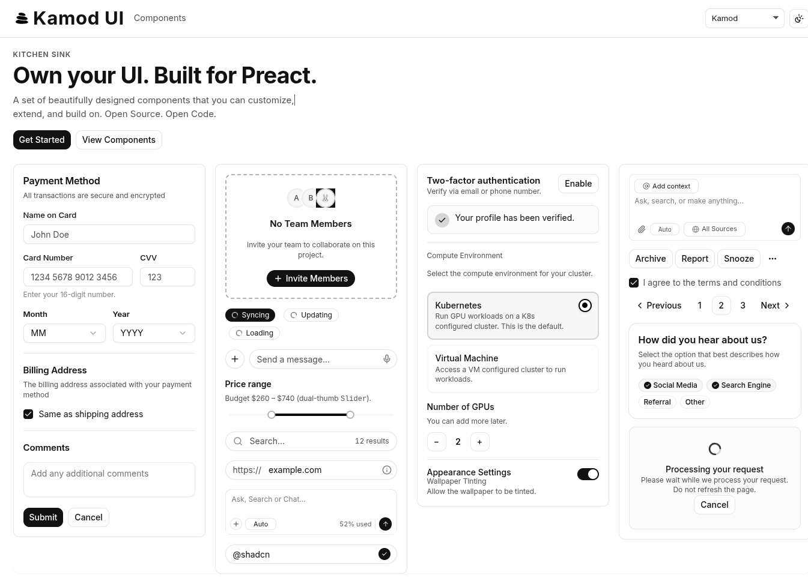

<p align="center">
  
  
</p>

<h1 align="center">Kamod UI</h1>

A set of beautifully designed components that you can customize, extend, and build on. **Built for Preact.** Open Source. Open Code.



## Live demo (GitHub Pages)

The deployed kitchen sink and docs live at the **repository root URL** of GitHub Pages, not under `apps/demo` (that path exists only in this monorepo):

**[https://kamod-ch.github.io/kamod-ui/](https://kamod-ch.github.io/kamod-ui/)**

If the site looks wrong (unstyled page or README-like content):

1. In the GitHub repo, open **Settings → Pages** and set **Source** to **GitHub Actions**, not “Deploy from a branch”. The workflow [`.github/workflows/deploy.yml`](.github/workflows/deploy.yml) publishes the contents of `apps/demo/dist` after a production build with the correct `VITE_BASE_PATH`.
2. Hard-refresh or use a private window to avoid a cached old deployment.

To preview **locally** the same build GitHub uses (including base path), from the repo root:

```bash
pnpm run preview:pages
```

Then open the URL printed in the terminal. For a fork, set `VITE_BASE_PATH` to `/<your-repo-name>/` before building (see `preview:pages` in the root `package.json`).

## Documentation

Run the demo app from the repo root:

```bash
pnpm install
pnpm dev
```

Then open the local URL printed in the terminal to browse the kitchen sink and component docs.

## Contributing

Pull requests and issues are welcome.
