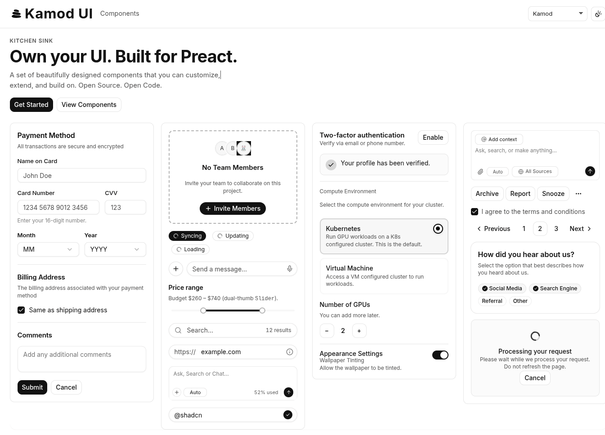

<p align="center">
  
  
</p>

<h1 align="center">Kamod UI</h1>

Lightweight UI components for **Preact** and **Tailwind**: composable primitives you can customize, extend, and ship without a heavy runtime. Open source; source is meant to be read and adapted.

- **Live demo:** [ui.kamod.ch](https://ui.kamod.ch/)
- **Repository:** [github.com/kamod-ch/kamod-ui](https://github.com/kamod-ch/kamod-ui/)



## Why Kamod UI?

Many UI kits are heavier than necessary, overly opinionated, or tied to React. Kamod UI targets a smaller stack instead:

- **Preact-first** — tiny runtime and familiar patterns if you already use React-like APIs.
- **Tailwind-native** — style with utilities instead of a separate theme layer.
- **Composable** — build UIs from small pieces without extra abstraction.
- **Practical** — ship only what you need; the codebase stays easy to follow.

## Comparison

| Feature | Kamod UI | Radix UI | shadcn/ui |
| --- | :---: | :---: | :---: |
| Preact support | ✅ | ❌ | ❌ |
| Tailwind-first | ✅ | ⚠️ | ✅ |
| Lightweight | ✅ | ⚠️ | ⚠️ |

## Live demo (GitHub Pages)

The deployed kitchen sink and docs live at the **repository root URL** of GitHub Pages, not under `apps/demo` (that path exists only in this monorepo):

**[https://kamod-ch.github.io/kamod-ui/](https://kamod-ch.github.io/kamod-ui/)**

## Documentation

Run the demo app from the repo root:

```bash
pnpm install
pnpm dev
```

Then open the local URL printed in the terminal to browse the kitchen sink and component docs.

## Using Kamod UI

Install the component package in a Preact app:

```bash
pnpm add @kamod-ui/core preact
```

Kamod UI components ship JSX and Tailwind utility classes. Your app must compile those classes and provide the semantic CSS tokens used by the components.

For Tailwind CSS v4, include your app CSS plus the package source in the file where you import Tailwind:

```css
@import "tailwindcss";
@source "../node_modules/@kamod-ui/core/dist/**/*.{js,mjs}";

@custom-variant dark (&:where(.dark, .dark *));

@theme inline {
  --color-background: var(--background);
  --color-foreground: var(--foreground);
  --color-card: var(--card);
  --color-card-foreground: var(--card-foreground);
  --color-popover: var(--popover);
  --color-popover-foreground: var(--popover-foreground);
  --color-primary: var(--primary);
  --color-primary-foreground: var(--primary-foreground);
  --color-secondary: var(--secondary);
  --color-secondary-foreground: var(--secondary-foreground);
  --color-muted: var(--muted);
  --color-muted-foreground: var(--muted-foreground);
  --color-accent: var(--accent);
  --color-accent-foreground: var(--accent-foreground);
  --color-destructive: var(--destructive);
  --color-destructive-foreground: var(--destructive-foreground);
  --color-border: var(--border);
  --color-input: var(--input);
  --color-ring: var(--ring);
  --color-outline: var(--outline);
}

:root {
  --background: var(--color-white);
  --foreground: var(--color-neutral-950);
  --card: var(--color-white);
  --card-foreground: var(--color-neutral-950);
  --popover: var(--color-white);
  --popover-foreground: var(--color-neutral-950);
  --primary: var(--color-neutral-950);
  --primary-foreground: var(--color-neutral-50);
  --secondary: var(--color-neutral-100);
  --secondary-foreground: var(--color-neutral-950);
  --muted: var(--color-neutral-100);
  --muted-foreground: var(--color-neutral-600);
  --accent: var(--color-neutral-100);
  --accent-foreground: var(--color-neutral-900);
  --destructive: var(--color-red-700);
  --destructive-foreground: var(--color-neutral-50);
  --border: var(--color-neutral-200);
  --input: var(--color-neutral-200);
  --ring: var(--color-neutral-400);
  --outline: var(--color-neutral-400);
  --radius: 0.625rem;
}

.dark {
  --background: var(--color-neutral-950);
  --foreground: var(--color-neutral-50);
  --card: var(--color-neutral-900);
  --card-foreground: var(--color-neutral-50);
  --popover: var(--color-neutral-800);
  --popover-foreground: var(--color-neutral-50);
  --primary: var(--color-neutral-50);
  --primary-foreground: var(--color-neutral-950);
  --secondary: var(--color-neutral-800);
  --secondary-foreground: var(--color-neutral-50);
  --muted: var(--color-neutral-800);
  --muted-foreground: var(--color-neutral-400);
  --accent: var(--color-neutral-800);
  --accent-foreground: var(--color-neutral-50);
  --destructive: var(--color-red-800);
  --destructive-foreground: var(--color-neutral-50);
  --border: --alpha(var(--color-neutral-50) / 10%);
  --input: --alpha(var(--color-neutral-50) / 15%);
  --ring: var(--color-neutral-500);
  --outline: var(--color-neutral-500);
}
```

The demo app keeps the full token setup in `apps/demo/src/styles/foundation.css` and theme presets in `apps/demo/src/styles/themes.css`.

## Contributing

- Open issues for bugs and ideas.
- Suggest new components or patterns.
- Improve docs and examples.

## Support

If you find Kamod UI useful:

- Star the repository.
- Share the project with others who use Preact or Tailwind.
